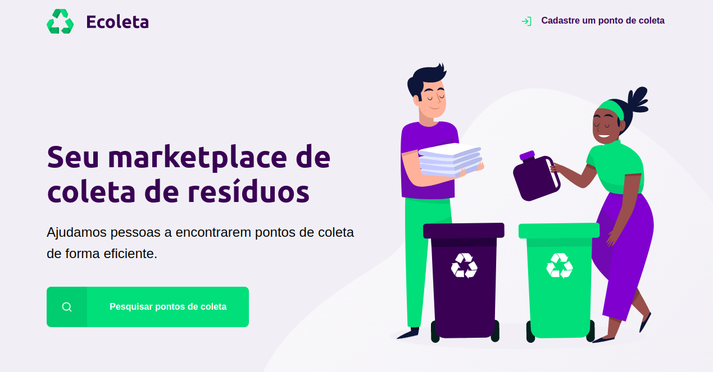

# NextLevelWeek
HTML | CSS | Javascript

O Next Level Week é um evento, realizado pela Rocketseat com o intuito de desenvolver uma aplicação do zero em 7 dias.
Para isso utilizaremos de conhecimentos de HTML, CSS e Javascript. Este é meu primeiro projeto, o Ecoleta, seguindo os modelos propostos.

Resultado do primeiro dia:

